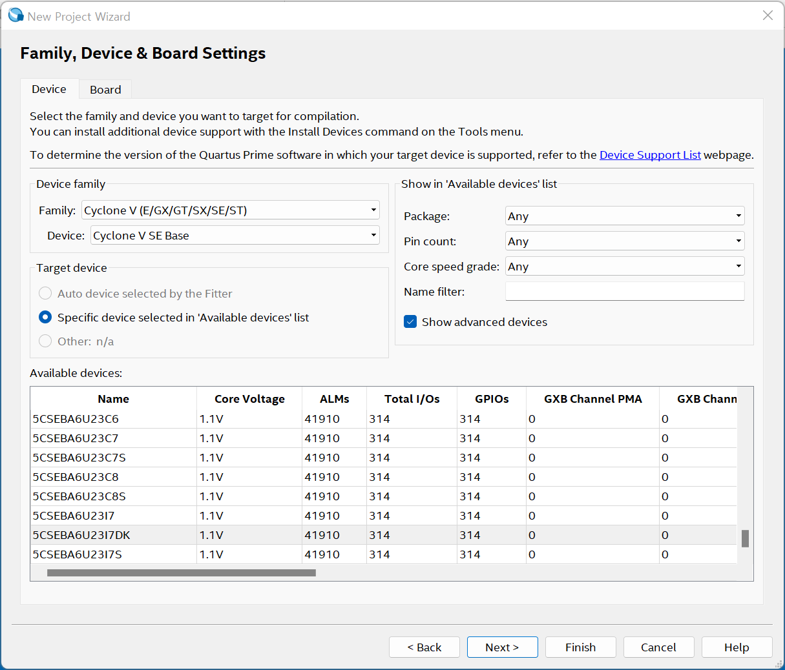
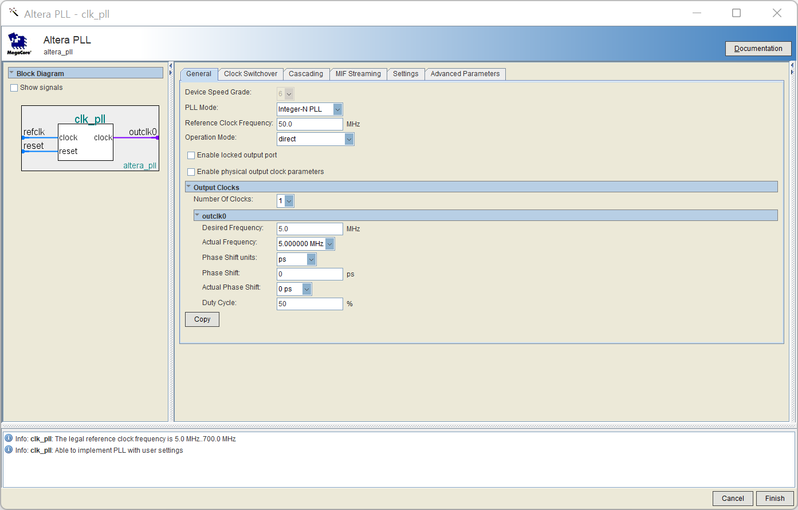
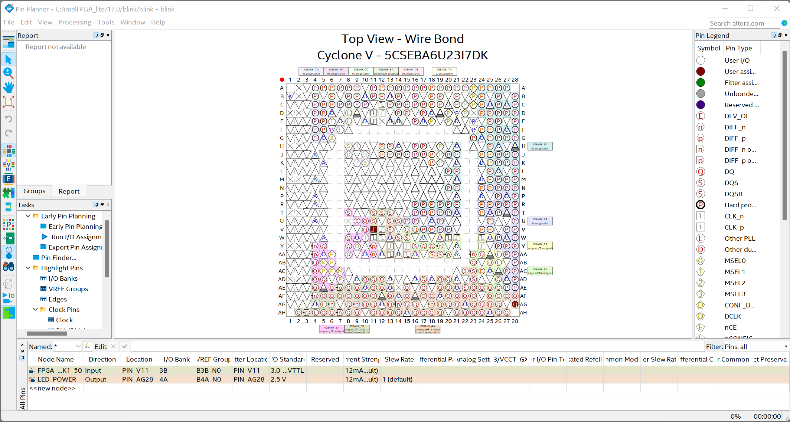
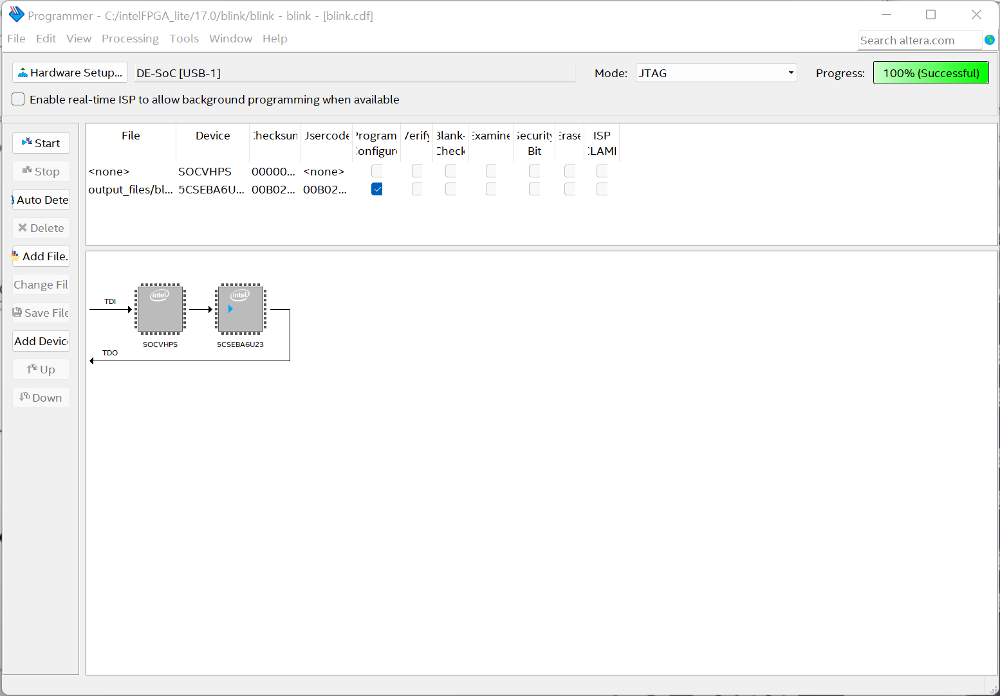

# Day 1: DE2 Nano Blink LED

- https://www.youtube.com/watch?v=qxgM9NPrhqw

## 환경설정

- Quotus Prime Lite 17.0 버전으로 다운받아서 설치 (반드시 같은 버전으로)
- MiSTer 카페 옥타민님 글이 큰 도움이 되었다.

## 프로젝트 진행

(1) `C:\intelFPGA_lite\17.0` 아래 `blink` 폴더 및 `blink.v` 작성

(2) Quatus Prime Lite 실행, 마법사로 새 프로젝트를 만든다.



(3) clk_pll을 추가한다.



(4) 컴파일 및 Pin 연결

Pin Planner 로 입출력 핀을 연결한다.




(5) 타겟 설정

MiSTer 전원과 USB를 연결하고, 프로그래머를 실행하고 설정하면 OK



(6) 동작 확인

보드에 빨간 불이 깜박이면 성공!


## 프로그램 설명

1. 기본 클럭을 입력으로 받는다. (FPGA_CLK1_50)
2. 기본 클럭을 1/10로 조정한다. (clk_pll)
3. 클럭에서 상승엣지가 있을 때마다 카운트를 1 증가
4. 24비트 카운트가 될때마다 LED에 불을 켠다.
5. LED를 출력으로 설정한다. (LED_POWER)

```verilog
module blink (
    input wire FPGA_CLK1_50, //50mhz input clock
    output wire LED_POWER // LED output    
);

wire clk;

clk_pll (
		.refclk(FPGA_CLK1_50),   //  refclk.clk
		.rst(),      //   reset.reset
		.outclk_0(clk)  // outclk0.clk
	);

reg [31:0] cnt; //32-bit counter

initial begin
    cnt <= 32'h00000000;
end

always @(posedge clk) begin
    cnt <= cnt + 1;
end

assign LED_POWER = cnt[24];

endmodule

```
## Verilog Tutorial

- https://hdlbits.01xz.net/wiki/Step_one


## 소감

- 헬로 월드에 해당하는 간단한 프로그램인데 어려웠다.
- 열심히 따라해서 6502 CPU를 설계하고 하드웨어를 붙여보자!

## References

- [Intel Quartus Lite 17.0](https://www.intel.com/content/www/us/en/software-kit/669557/intel-quartus-prime-lite-edition-design-software-version-17-0-for-windows.html?)
- https://www.jameco.com/